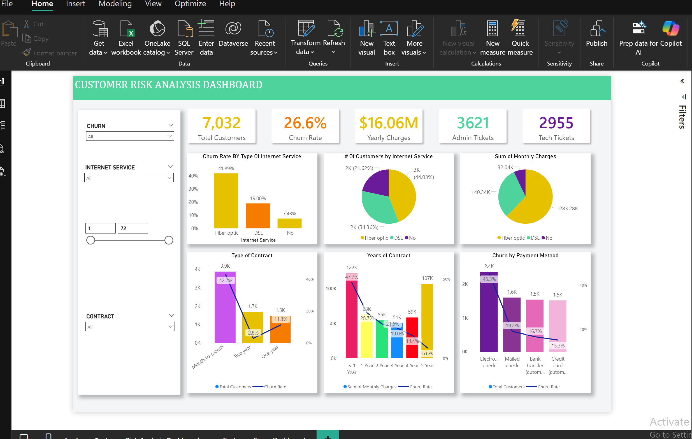
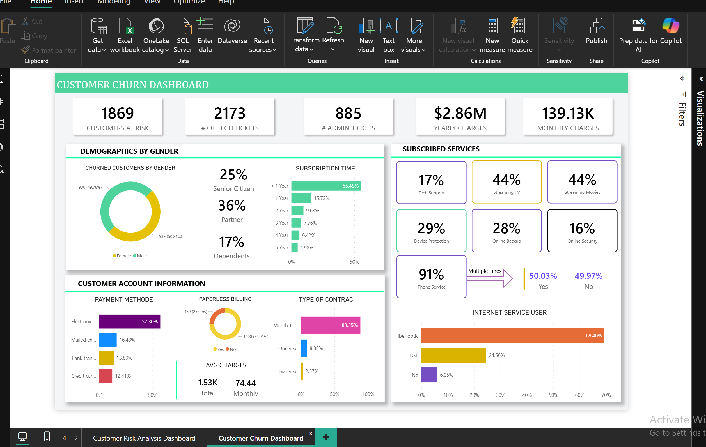

# Customer Churn & Risk Analysis

## Overview

A Power BI data analysis project focused on understanding customer churn, identifying customers at risk, and analyzing customer subscription and service behavior.

The project includes two interactive dashboards:

1. Customer Risk Analysis Dashboard
2. Customer Churn Dashboard

---

## Dashboard 1: Customer Risk Analysis

The Customer Risk Analysis Dashboard provides an overview of customer churn, risk indicators, charges, tickets, internet services, contracts, and payment methods.

### Key Metrics

- Total Customers: 7,032
- Churn Rate: 26.6%
- Yearly Charges: $16.06M
- Admin Tickets: 3,621
- Tech Tickets: 2,955

### Analysis

The dashboard includes:

- Churn Rate by Internet Service
- Customer Distribution by Internet Service
- Monthly Charges by Internet Service
- Churn by Contract Type
- Contract Duration Analysis
- Churn by Payment Method
- Customer filtering by churn status
- Customer filtering by internet service
- Customer filtering by contract
- Tenure filtering

---

## Dashboard 2: Customer Churn

The Customer Churn Dashboard focuses on customer churn behavior, customer demographics, account information, subscribed services, and customer risk.

### Key Metrics

- Customers at Risk: 1,869
- Tech Tickets: 2,173
- Admin Tickets: 885
- Yearly Charges: $2.86M
- Monthly Charges: $139.13K

### Analysis

The dashboard includes:

#### Demographics

- Churned Customers by Gender
- Senior Citizen Status
- Partner Status
- Dependents
- Subscription Time

#### Customer Account Information

- Payment Method
- Paperless Billing
- Contract Type
- Average Charges

#### Subscribed Services

- Tech Support
- Streaming TV
- Streaming Movies
- Device Protection
- Online Backup
- Online Security
- Phone Service
- Multiple Lines

#### Internet Service

- Fiber Optic
- DSL
- No Internet Service

---

## Tools & Technologies

- Microsoft Power BI
- Power Query
- DAX
- Data Cleaning
- Data Analysis
- Data Visualization
- Interactive Dashboards

---

## Project Objectives

- Analyze customer churn patterns
- Identify customers at risk
- Analyze customer behavior across different services
- Understand the relationship between churn and contract type
- Analyze customer subscription and account information
- Present insights through interactive Power BI dashboards

---

## Dashboard Previews

### Customer Risk Analysis Dashboard

### Customer Churn Dashboard

---

## Project File

The Power BI project file is included in this repository:

`Customer-Churn-Risk-Analysis.pbix`
